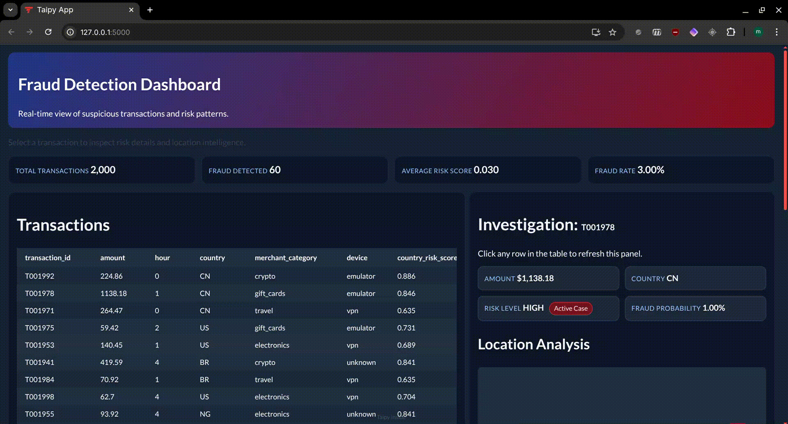

# Fraud Detection mit Taipy

## Überblick
Dieses Projekt demonstriert ein simples Fraud Detection System. Das Script "fraud_scoring.py" bewertet ein Set von Transaktionen auf betrügerische Muster. Anschliessend werden die Transaktion im Fraud Detection UI dargestellt und können analysiert werden.

Demo:

